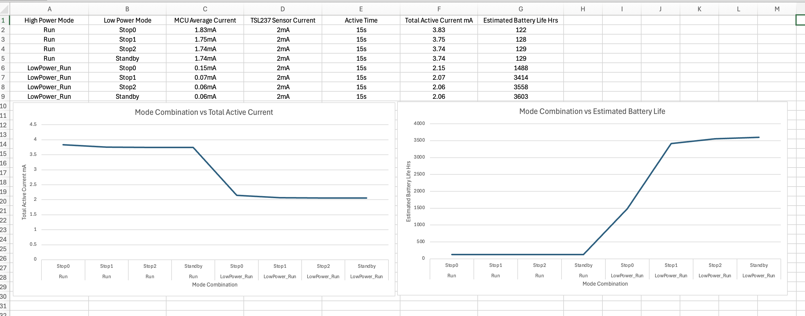
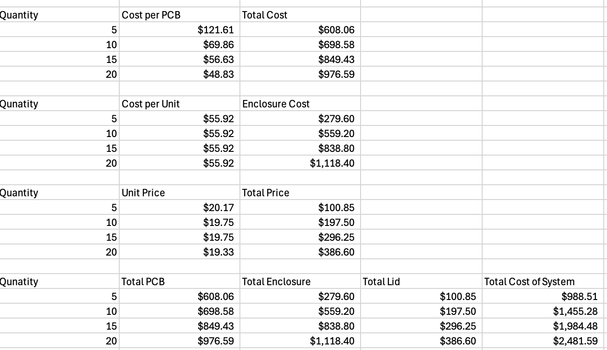

# Lab 10 – Power & Prototype Cost Analysis

## Overview
In this lab, I developed a complete **power management strategy** and **prototype cost analysis** for an STM32-based embedded system. The goal was to evaluate system efficiency and scalability by analyzing battery life and production cost across different operating conditions.

This lab represents a transition from system design to **real-world feasibility**, incorporating both energy optimization and manufacturing considerations.

---

## Objective
- Estimate system power consumption using STM32CubeMX  
- Evaluate battery life across multiple operating modes  
- Design an optimal power management strategy  
- Analyze prototype manufacturing costs at different scales  
- Develop a system that balances **performance, efficiency, and cost**  

---

## Power Management Design

### System Assumptions
- System samples light data every **15 minutes**  
- Operates for **12 hours per day**  
- Each sample takes up to **15 seconds**  
- Powered by a **CR2032 Li-MnO₂ battery** :contentReference[oaicite:0]{index=0}  

---

### Operating Modes Considered
#### Running Modes
- RUN (Range 1)  
- RUN (Range 2)  
- Low Power Run (LPRUN)  

#### Low Power Modes
- SLEEP  
- Low Power Sleep (LPSLEEP)  
- STOP 0 / STOP 1 / STOP 2  
- STANDBY (+32KB and standard)  

---

### Power Analysis Approach
- Used **STM32CubeMX power consumption calculator**  
- Modeled both:
  - Microcontroller consumption  
  - External light sensor current draw  
- Evaluated all combinations of run + low power modes  
- Generated plots and tables to compare efficiency  

---

## Power Analysis Results

  

The analysis compares power consumption across operating modes, highlighting tradeoffs between performance and energy efficiency.

---

## Power Management Conclusion
Based on the analysis:

- Lower power modes significantly extend battery life  
- Tradeoffs exist between wake-up latency and efficiency  
- Optimal configurations balance:
  - Sampling performance  
  - Energy consumption  
  - System responsiveness  

---

## Prototype Cost Analysis

### Manufacturing Components
- Printed Circuit Board (PCB) via MacroFab  
- 3D-printed enclosure via Shapeways  
- Laser-cut lid via Sculpteo  

---

### Cost Scaling Analysis
Estimated cost for production quantities:
- 5 units  
- 20 units  
- 50 units  
- 100 units  

  

---

## Cost Analysis Insights
- Per-unit cost decreases with higher production volume  
- PCB fabrication dominates early-stage costs  
- Mechanical components (enclosure + lid) significantly impact total cost  
- Economies of scale improve feasibility for larger production runs  

---

## What I Learned
- How to design power-efficient embedded systems  
- Tradeoffs between performance and energy consumption  
- How battery constraints influence system design decisions  
- Fundamentals of prototype cost estimation and scaling  
- How engineering decisions impact real-world feasibility  

---

## Future Improvements
- Optimize firmware for lower power consumption  
- Explore alternative battery options or power sources  
- Reduce PCB complexity to lower cost  
- Optimize enclosure design for manufacturing efficiency  

---

## Repository Context
This lab represents the final stage of system evaluation in the STM32 Embedded Systems Project, combining:

- Embedded firmware  
- Hardware design  
- Mechanical enclosure  
- Power optimization  
- Cost analysis  

into a complete, real-world engineering system.
