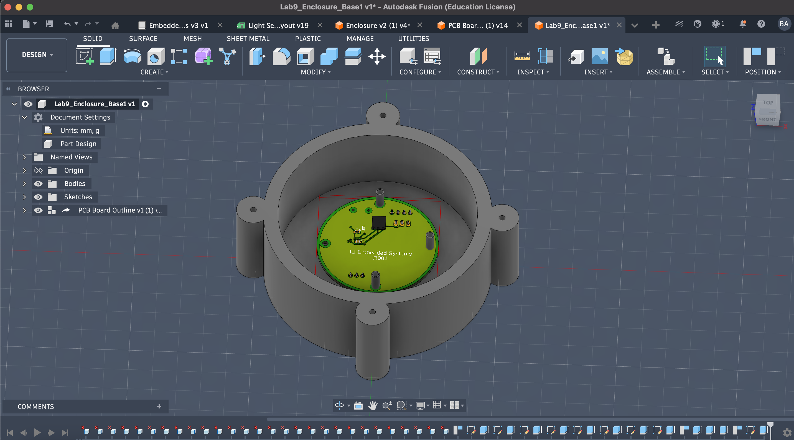
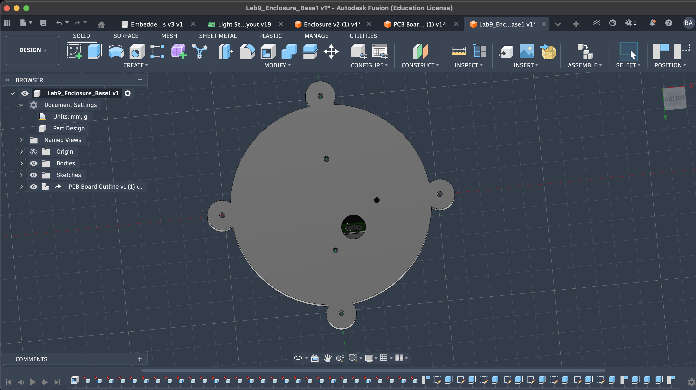
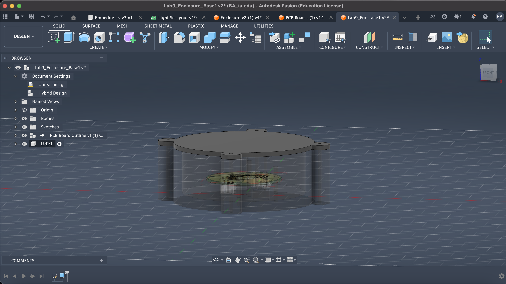

# Lab 9 – Enclosure Design

## Overview
In this lab, I designed a custom enclosure for an STM32-based embedded system to protect electronic components while maintaining functionality and accessibility.

The design focuses on environmental protection, mechanical stability, and system integration, resulting in a complete embedded system ready for real-world deployment.

---

## Objective
- Protect electronic components from environmental exposure (moisture)  
- Secure the circuit board within the enclosure  
- Allow sensor functionality through a clear lid  
- Provide access to communication interfaces  
- Design a complete enclosure using CAD tools  

---

## Design Requirements
The enclosure was designed to meet the following constraints:

- Prevent moisture from reaching the circuit board  
- Securely mount the PCB using integrated standoffs  
- Include a clear lid to allow light to reach the sensor  
- Provide access to the 3-pin communication connector  
- Ensure proper alignment between enclosure and PCB components  

---

## Design Approach

### Base Design
- Created a **3D-printed base** to house the electronics  
- Integrated **standoffs** to support the circuit board and prevent shifting  
- Designed internal spacing to accommodate components and battery holder  

---

### Sealing & Protection
- Incorporated an **O-ring sealing mechanism** to prevent moisture ingress  
- Designed enclosure edges to ensure proper compression of the seal  

---

### Lid Design
- Designed a **laser-cut clear acrylic lid**  
- Allows light to reach the sensor while protecting internal components  
- Ensures proper alignment with enclosure and sealing interface  

---

### Connector Access
- Designed a **precision opening** for the 3-pin communication port  
- Positioned using the exact center of the connector  
- Allows easy access without compromising enclosure protection  

---

## System Integration
The enclosure integrates:

- **Mechanical system** – enclosure base and lid  
- **Electrical system** – STM32 circuit board  
- **Sensor system** – light sensor aligned with clear lid  

This results in a fully integrated embedded system with both protection and functionality.

---

## Results
- Successfully designed a complete enclosure system  
- Protected electronics from environmental exposure  
- Maintained sensor functionality through clear lid design  
- Enabled external communication through accessible port  

---

## What I Learned
- How to design enclosures for real-world embedded systems  
- The importance of environmental protection in electronics  
- How mechanical tolerances affect system performance  
- Integration of CAD design with hardware constraints  

---

## Design Renderings

### PCB Light Sensor Enclosure Base (Top View)

  

---

### PCB Light Sensor Enclosure Base (Bottom View – Rubber Plug)

  

---

### PCB Light Sensor Enclosure Lid (Side View)

  

---

## Future Improvements
- Improve sealing for higher environmental resistance  
- Optimize design for manufacturability  
- Reduce material usage and overall size  
- Add mounting options for external deployment  

---

## Repository Context
This lab represents the final stage of system integration in the STM32 Embedded Systems Project, combining firmware, hardware, and mechanical design into a complete embedded solution.
